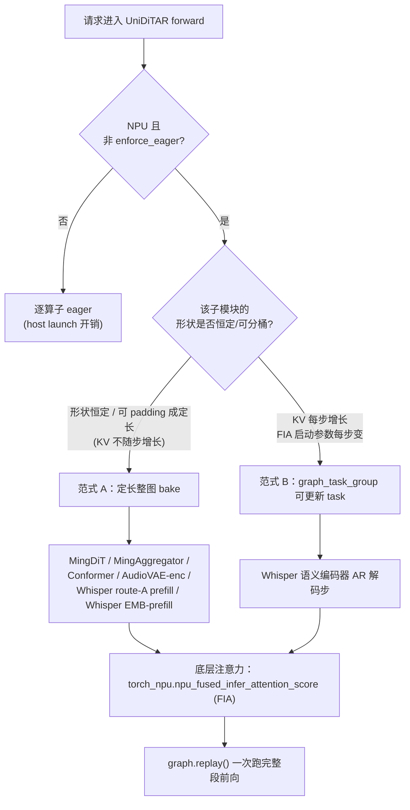
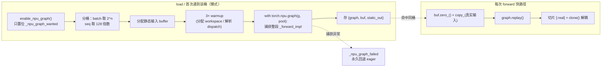
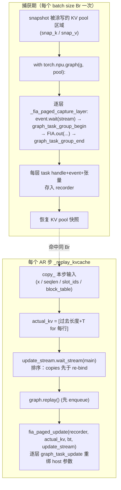
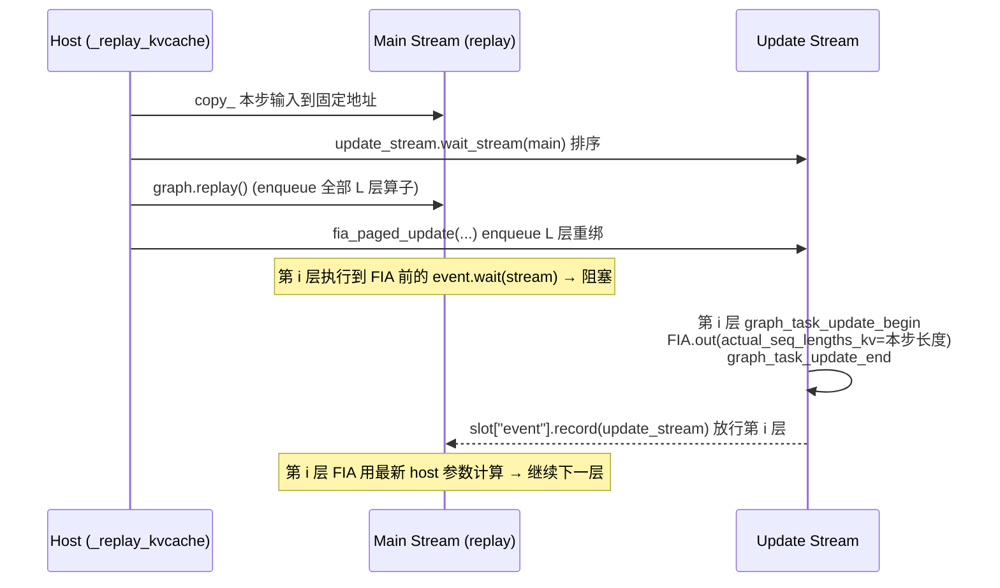

# UniDiTAR NPU 图捕获（入图）实现总结

> 适用代码库：`/data/tha/ttt/vllm-omni-aigc`（模块名 `uniditar`）
> 平台：Ascend NPU（无 Inductor 后端，因此用 `torch.npu.NPUGraph` 手动捕获，而非 `torch.compile`）
> 目标：消除逐算子 host launch（`aclrtLaunchKernelWithHostArgs`）开销，把各编码器/解码子模块用 NPU 图 `replay` 一次跑掉。

---

## 0. 背景与两种捕获范式

Ascend 上 SDPA 会 lower 成在辅助流上启动的 kernel，**破坏图捕获**；而 CANN 的 `torch_npu.npu_fused_infer_attention_score`（下称 **FIA**）是可捕获、可 bit-exact replay 的融合注意力算子。所有注意力入图都围绕 FIA 展开。

本项目里存在**两种**图捕获范式：

| 范式 | 适用场景 | 机制 | 代表模块 |
|---|---|---|---|
| **A. 定长整图 bake** | 形状恒定 / 可分桶 padding 成定长 | `torch.npu.graph` 捕获整段前向，静态 buffer + `replay()` | MingDiT、MingAggregator、Conformer、AudioVAE encoder、Whisper 的 EMB-prefill / route-A prefill |
| **B. `graph_task_group` 可更新任务** | KV 每步增长、FIA 启动参数每步变 | 每层 FIA 录成可更新 task，replay 前在 `update_stream` 上重绑定 | Whisper 语义编码器的 **AR 解码步** |

范式 A 的通用套路（**贯穿所有模块**）：

1. `enable_npu_graph(...)`：只置位 `_npu_graph_wanted`，**不立即捕获**（懒式，等权重加载完、拿到真实 dtype/device/shape）。
2. 分桶：batch 向上取 2 的幂、序列长度向上取固定倍数（多为 128 = FIA page block）。
3. `_maybe_capture_*`：分配静态输入 buffer → 3 次 warmup（分配 workspace / 解析 dynamic dispatch）→ `with torch.npu.graph(g, pool=...)` 捕获 → 存 `{graph, buf, static_out}`。
4. `forward` 快路径：`buf.zero_()` + `copy_(真实输入)` → `entry["graph"].replay()` → 切片 `[:real]` → `clone()` 解耦静态 buffer。
5. 失败即优雅降级：捕获异常 → 置 `_npu_graph_failed` → 永久回退 eager。

**因果注意力下 padding 的 bit 等价性**（范式 A 分桶的正确性基石）：把每行 pad 到 `T_bucket` 跑等长因果注意力时，有效 token `t`（`t < 真实长度`）只 attend `0..t`，永远看不到尾部 padding，因此有效区输出与变长 varlen **逐字节一致**；padding 行/位的输出被切片丢弃或置零。

---

## 0.1 流程架构图总览

> 本节用图把入图的全景一次讲清：①各模块如何分流到两种范式；②范式 A / B 各自的生命周期；③范式 B 最关键、也最难理解的**双流事件同步时序**。文字细节见后续 §1–§8。

### 图 1：模块分发架构（谁走范式 A、谁走范式 B）



### 图 2：范式 A 生命周期（capture 一次 → replay 多次）



### 图 3：范式 B 生命周期（capture + 每步 task 更新 + replay）



### 图 4：范式 B 双流事件同步时序（最关键，对应 §7.1）

> 图内每层 baked 的 `event.wait` 让**主流**在该层 FIA 处停下，等 **update_stream** 用本步长度重绑定并 `event.record` 放行。设备端顺序恒为 **copies → FIA 重绑定 → FIA 计算**，与 host 端两次调用先后无关。



**读图要点**：
- 图 1 的分流关键只有一句话——**KV 是否每步增长**。增长（Whisper AR）就必须范式 B，其余全走范式 A。
- 范式 A（图 2）与范式 B（图 3）的本质差异：A 是"copy 输入 → replay"两步；B 多了"每步 task 更新 FIA 的 host 启动参数"这一步（原因见 §2.5）。
- 图 4 的双流同步是范式 B 正确性的核心：`event.wait / record` 保证无论 host 端 `replay()` 与 `fia_paged_update()` 谁先调用，设备端 FIA 一定拿到本步最新的 `actual_seq_lengths_kv`。

---

## 1. 核心注意力基础设施：`diffusion/attention/backends/utils/fa.py`

所有 FIA 调用与 `graph_task_group` 机制的载体。

### 1.1 平台分发（`flash_attn_varlen_func`）
```
485  if current_omni_platform.is_npu():
496      flash_attn_varlen_func = _npu_fia_varlen_attn
```
NPU 上 `flash_attn_varlen_func` 绑定到 `_npu_fia_varlen_attn`（TND varlen 单次调用整批）。

### 1.2 plain varlen（`_npu_fia_varlen_attn`，368）
- `q/k/v` 为 `(total, n_heads, head_dim)` == TND；`cu_seqlens` 累积偏移。
- **关键行 446-451**：`cu_seqlens_q.tolist() if torch.is_tensor(...) else list(cu_seqlens_q)` —— 若传入的是 **device tensor** 会触发 `.tolist()` 的 **D2H 同步**（捕获期非法）；若传入 **host list** 则走 `list(...)` 无同步。→ 这正是范式 A 各编码器构造 meta 时**刻意把 `cu_seqlens` 存成 Python list** 的原因。
- `sparse_mode=4` + 压缩 2048×2048 band mask + `pre_tokens`（`INT_MAX` 全因果 / `left_window` 滑窗）+ `next_tokens=0` 复现因果(+滑窗)掩码。

### 1.3 paged / KV-cache（`_npu_fia_paged_attn`，107）
- 把静态 KV pool `(BC, max_k, n_kv, hd)` **零拷贝 reshape** 成 paged `(BC*nblk, 128, n_kv*hd)`（`nblk = max_k/128`）。
- `actual_seq_lengths_kv`（per-row K 长度）是 **host `List[int]` 启动参数**——这是 KV 增长时无法整图 bake、必须用范式 B 的根本原因。
- `build_fia_paged_params`（53）：把 `(Br,nblk)` 块表 + 两个 host 长度表**每步在编码器层级预算一次**，避免每层各做一次 `.tolist()`。

### 1.4 `graph_task_group` 机制（范式 B 核心）
- `_fia_paged_capture_layer`（258）：**捕获期**每层不 bake 静态 FIA，而是：
  ```
  293  event.wait(stream)              # 捕获时 bake：主流在此层 FIA 处等 update_stream
  296  torch.npu.graph_task_group_begin(stream)
  297  torch_npu.npu_fused_infer_attention_score.out(**base, workspace=..., out=[output, softmax_lse])
  300  handle = torch.npu.graph_task_group_end(stream)
  ```
  把每层 task handle + 事件 + 弱引用张量存进 `recorder`。
- `fia_paged_update`（324）：**每步 replay 前**在 `update_stream` 上对全部层：
  ```
  342  with torch.npu.stream(update_stream):
  344      graph_task_update_begin(update_stream, slot["handle"])
  345      npu_fused_infer_attention_score.out(... actual_seq_lengths_kv=<本步长度> ...)
  364      graph_task_update_end(update_stream)
  365      slot["event"].record(update_stream)   # 放行主流该层
  ```
  即用本步增长后的 `actual_seq_lengths_kv` / 块表重绑定，再 record 事件让被 replay 的主流该层继续。

---

## 2. 范式 B 深入：FIA 可更新 task 的本质与关键答疑

> 本节回答的是"**为什么必须这么做**"层面的问题——这些才是入图方案里真正重要、也最容易被误解的点。全部围绕 §1.3 / §1.4 的 FIA paged + `graph_task_group` 机制。

### 2.1 一条环环相扣的主线

范式 B 的所有机制不是孤立设计，而是从"想入图"这一个目标推导出来的必然链条：

```
想入图（消除逐算子 host launch）
  → NPU Graph 铁律：捕获期所有 tensor 地址/形状必须静态、不可 D2H 同步
    → KV cache 不能每步 torch.cat 出新形状/新地址 → 只能用一块超额预分配的静态大 pool
      → pool 里绝大部分是尚未写入的 padding → 必须有个"有效长度"参数告诉 FIA 每行读到哪
        → 这个有效长度每 AR 步都增长（每步多写 T 个 token）
          → 它是 FIA 的 host 启动参数、无 device 地址可 .copy_() 更新
            → 只能在每次 replay 前用 graph_task_update 重新绑定
              → 于是有了"每层 FIA 录成可更新 task"（graph_task_group）
```

**去掉链条上任何一环都会破坏入图**。下面逐环拆解。

### 2.2 NPU 上 `flash_attn_varlen_func` 就是 FIA —— 不是"可选算子"

一个常见误解是把 `npu_fused_infer_attention_score`（FIA）当成"新增的、可以换回 `flash_attn_varlen_func` 的算子"。**在昇腾上二者是同一个东西**：

```
485  if current_omni_platform.is_npu():
496      flash_attn_varlen_func = _npu_fia_varlen_attn   # ← 名字被绑定成 FIA 实现
```

Ascend **没有 `flash_attn` 这个 pip 包**，`flash_attn_varlen_func` 这个名字在 NPU 上就是 `_npu_fia_varlen_attn`，带 `block_table` 时进 `_npu_fia_paged_attn`，最终落到 `torch_npu.npu_fused_infer_attention_score`。调用链：

```
flash_attn_varlen_func(seqused_k=..., block_table=...)   # 上层写法
   │  （NPU 上 == _npu_fia_varlen_attn）
   ▼ block_table 非 None → paged 分支
_npu_fia_paged_attn(...)                     fa.py:107
   ▼
torch_npu.npu_fused_infer_attention_score(...)   fa.py:216  ← 唯一落地
```

**结论**：CUDA 上才有独立的 `flash_attn` 包；NPU 上 FIA 是 `flash_attn_varlen_func` 的唯一实现本体。"换成 patch 的 `flash_attn_varlen_func`" 在 NPU 上等于没换——底层照样是 FIA。

### 2.3 `actual_seq_lengths_kv`：是什么 / 为什么每步增长 / 能不能去掉

**是什么**：`(Br,)` 的 per-row 有效 K 长度 = `过去KV长度 + 当前步q长度`（`fa.py:98` 的 `seqused_k.to(int32).tolist()`，`seqused_k = cache_seqlens_before + T`）。它告诉 FIA 每个请求在静态 pool 里真实数据到哪为止：

```
slot 里的实际情况：
  [tok0][tok1]...[tok19] [padding][padding]...      max_k=4096
   └──── 有效 20 个 ────┘ ↑
                  actual_seq_lengths_kv=20，FIA 只读到这里，不把 padding 塞进 softmax
```

**为什么每步增长**：自回归每步往 pool 里多写 T 个 token，有效边界后移，所以它每步 +T。

**能不能去掉**（三种"去掉"含义，全部行不通或代价极大）：

| 方案 | 能否去掉 | 能否入图 | 代价 |
|---|---|---|---|
| 当前：静态 pool + 每步动态更新长度 | 否（核心机制） | ✅ | 需要 task 更新的少量复杂度 |
| 改回每步动态紧凑 K/V（`torch.cat`） | ✅ | ❌ 形状/地址每步变，无法捕获 | 退回 host-bound eager |
| 静态 pool 但恒按 `max_k` 满额算 | ✅（bake 常量） | ✅ | padding 需额外 mask 成 -inf + O(len²) 巨大算力浪费 |

一句话：`actual_seq_lengths_kv` 不是可有可无的附加项，而是"静态 pool 入图"这条路线的**必然产物**。

### 2.4 `seqused_k` 与 `actual_seq_lengths_kv`：同一个量的两种形态

它们是**同一个"有效长度"**，只是形态与转换时机不同，对应 patch → 入图 的演进：

| | patch 版本（`kv_cache.diff`） | 现在（入图版） |
|---|---|---|
| 名字 | `seqused_k` | `actual_seq_lengths_kv` |
| 形态 | device tensor `(Br,)` | host `List[int]` |
| 谁做 D2H 转换 | `flash_attn_varlen_func` **封装内部** `.tolist()` | 提前到 encoder 层 `build_fia_paged_params` 做一次 |
| 转换时机 | 图内、每层各一次 | 图外、每步一次 |

FIA 内核**只吃 host `List[int]`**（硬性接口），所以 device→host 的 `.tolist()` **必然发生**。区别只是：
- patch 版把它藏在层内 → 每层一次 D2H sync，且发生在图捕获期 → **捕获非法**。
- 入图版用 `build_fia_paged_params` 把它**从"图内、每层"挪到"图外、每步一次"**（`fa.py:66-69` 注释），既能入图又不牺牲性能。

**所以不能"换回 `seqused_k`"**：那等于把 `.tolist()` 塞回层循环、在捕获期做 L 次 D2H —— 要么捕获直接失败，要么退回 host-bound。

### 2.5 NPU Graph 录的是"地址流水账"，不是"数值流水账" —— 为什么只有 FIA 需要 task 更新

这是理解"为什么替换 FIA 一处、其余算子输入输出不用管"的关键。

**核心机制**：`torch.npu.graph(g)` 捕获时，图记录的是每个算子**从哪个固定地址读、往哪个固定地址写、用什么参数**——记的是**地址**，不是那一刻的数值。所以 replay 时：

```
只要把新数据 .copy_() 进那些"固定地址"，
图 replay 就自动用新数据算出新结果，全程不碰算子本身。
```

`_replay_kvcache`（`semantic.py:1025`）正是这样：`entry["x"].copy_(x_packed)`（原地拷贝、地址不变、只覆盖内容），而非 `entry["x"] = x_packed`（换对象）。图里所有算子读的还是同一块地址，新值像流水线一样自动传导。

**那为什么 FIA 特殊**？因为变化的东西分两类：

| 变化的东西 | 类型 | 捕获时怎么记 | replay 怎么更新 |
|---|---|---|---|
| `x_packed`（hidden state） | device tensor | 记地址 | `.copy_()` 到固定地址 ✅ |
| `cache_seqlens` / `slot_ids` / `block_table` | device tensor | 记地址 | `.copy_()` 到固定地址 ✅ |
| **`actual_seq_lengths_kv`** | **host int 列表** | **编进 kernel launch 参数** | **无地址可 copy → 必须 task 更新** ❌ |

`actual_seq_lengths_kv` 是 host `List[int]`，捕获瞬间"数值级"固化进 kernel 的启动参数，没有对应 device 地址可 copy。想改它唯一办法就是用 `graph_task_update` 把这个 FIA 算子的 launch 参数重新下发。

> `block_table` 为何也出现在 `fia_paged_update` 里？它的**内容**通过 `.copy_()` 写进固定地址 `entry["bt"]`，但为确保 FIA kernel 基于最新块表重算分块 tiling，把**同一个地址**在 task 更新时再显式传一遍触发重读（传的是地址，不是新对象）。

**类比**：图是一条固定流水线。传送带上的物料箱（device tensor）位置固定，换新料（`.copy_()`）跑一遍就出新品——**MLP、LN、RoPE、KV-scatter 等绝大多数算子全靠这个，零额外操作**。唯有某台机器的"配方拨盘"（FIA 的 host 参数）在建线时焊死了，换料没用，必须手动拧一下（`graph_task_update`）。

### 2.6 task 组 ≠ 一张图，task 更新 ≠ 重新捕获

最易混淆的一点，答案是否定的：

```
一张 NPU Graph = 整个 forward 的完整录制
  ├── 第 0 层: LN → FIA(task组0) → LN → MLP
  ├── 第 1 层: LN → FIA(task组1) → LN → MLP
  ├── ...
  └── 第 L-1 层: ... → LN_post
```

- **一张图** = 一次 `torch.npu.graph(g)` 上下文里录制的**全部 L 层算子**。
- **task 组** = 图里被标记为"可更新"的一个**子区间**，只含一个 FIA 调用。

| 操作 | 发生次数 | 耗时 | 做了什么 |
|---|---|---|---|
| 图捕获 `torch.npu.graph()` | 每个 batch size 一次 | 数百 ms | 记录全部算子调度序列 |
| task 更新 `fia_paged_update` | 每次 replay 前一次 | 微秒级 | 仅替换 FIA 的 host 参数 |
| 图 replay `graph.replay()` | 每个 AR 步一次 | 正常耗时 | 一次性重放全部算子 |

类比：图捕获=拍电影；task 更新=放映前换张海报；replay=按录好的放映。task 更新用的是 runtime 级轻量接口 `graph_task_update_begin/end`，**只重绑参数，不重录图拓扑**。

### 2.7 为什么是"每层"独立 task

虽然 `block_table` / `actual_seq_lengths_kv` 对所有层相同（KV pool 全局一份、slot 映射全局一致），但**每层有独立的 graph-internal tensor**：

| 每层独有 | 说明 |
|---|---|
| `q` | 每层 hidden state 不同（流入上一层输出） |
| `k_paged` / `v_paged` | pool 按 `[layer_idx]` 索引，每层取不同层切片 |
| `output` | 每层注意力输出 buffer |
| `workspace` | 每层单独的 workspace（`get_max_workspace` 按形状分配，地址独立） |
| `softmax_lse` | 每层独立的 softmax log-sum-exp 中间结果 |

这些 tensor 地址在捕获时分配。`graph_task_group` 按调用粒度划分——一层一个 FIA 调用 = 一个 task 组。若做成全局一个 task，就无法区分"哪些 output buffer 归哪层"，图的数据依赖会断裂。所以 `_fia_paged_capture_layer` 逐层 append 进 `recorder`，`fia_paged_update` 逐层更新。

### 2.8 概念速查表

| 概念 | 含义 |
|---|---|
| `(Br,)` | 形状标注，一维张量长度 = `Br` = 当前 AR 步**活跃请求数**（并发 talker 数），每元素对应一个请求 |
| **slot** | KV pool 的行索引 `s ∈ [0, BC)`，一个请求占一个"车位"，多步 AR 间保持同一 slot 直到完成释放 |
| **block_table** | "slot 编号 → block 编号"的翻译表；pool 连续，故 slot `s` 天然拥有 blocks `[s*nblk, s*nblk+nblk)`，展开为纯 arange 加法 |
| **handle** | `graph_task_group_end` 返回的不透明句柄，runtime 用它唯一定位一个 task 组，后续 `graph_task_update_begin(stream, handle)` 凭它"遥控"该算子 |
| **MLP** | Transformer block 的前馈子层（两层 Linear + 激活），**全静态权重、无每步变化量**，可直接 bake 进图，无需 task 更新 |
| **workspace** | FIA kernel 的临时计算空间，捕获时按形状 `get_max_workspace` 一次分配、每次 replay 复用 |
| **softmax_lse** | FIA 输出的 softmax log-sum-exp 中间量，每层独立 buffer |

---

## 3. MingDiT（flow-matching 扩散主干）—— 范式 A（最早的模板）

文件：`modeling_dit.py`，类 `MingDiT`（261）。**形状恒定**（seq == `1 + pre_patch + patch`，只有 batch 变），是范式 A 的原型。

- `enable_npu_graph(max_batch)`（321）：置位；`max_batch = 2 * max_num_seqs`（CFG `[uncond|cond]` 翻倍）。
- `_maybe_capture_graphs`（339）：按 2 的幂 batch 分桶，为每桶分配 `_buf_x/_buf_t/_buf_c/_buf_h` 静态 buffer，3 次 warmup 后 `with torch.npu.graph(g, pool=pool)` 捕获，存 `(g, static_out)`。
- `forward`（393）：仅 `mask is None` 的 euler 分支走图 → `copy_` 四个输入 → `replay()` → 返回 `entry[1][:real]`（padding 行不影响有效行，注意力 batch 无关）。
- `_forward_impl`（424）：eager 主体，也是被捕获体。DiT 注意力用可捕获的 `_fia_dense_full_attn`（FIA，非 SDPA）。

---

## 4. MingAggregator（patch 聚合器）—— 范式 A（懒式分桶 + 大 batch 分块 tiling）

文件：`modeling_dit.py`，类 `MingAggregator`（448）。初版参考 `/data1/zl/patches/0001-feat-uniditar-add-mingaggregator-npu-graph.patch`（与 MingDiT 同构、仅覆盖 AR 步）；后续扩展为**同时覆盖 prefill**。

### 4.1 为何需要扩展：prefill 的 batch 远超 AR
MingAggregator 唯一调用点是 `_aggregate`（`uniditar_talker.py:786`）：
```python
x = target.reshape(B, -1, ps, C).reshape(-1, ps, C)   # (B*P, ps, C)
out = self.aggregation_encoder(x)                      # (B*P, 1, llm_input_dim)
```
进入聚合器的有效 batch = **`B*P`**（P = patch 数）。
- **AR 解码步**（`_step_patch_ar`）：每请求一个新 patch → P=1 → batch = B ≤ `max_num_seqs`（命中小桶）。
- **prefill**（`_aggregate` at talker:1270，整段 prompt latent）：P = `T_pad/patch_size` 可达上百 → batch = `B*P` **远超** `max_num_seqs` → 初版按 `max_num_seqs` 分桶命中不到 → **回退 eager**（prefill 没入图的根因）。

### 4.2 解法：利用注意力逐行独立 → 分块 replay
MingAggregator 的注意力是**逐行独立**的（每行是独立的 `patch+1` 序列，无跨行注意力），非 batch 维恒定。故用**懒式 2 的幂分桶 + 大 batch 分块（tiling）**：

- `enable_npu_graph(max_batch)`（503）：`max_batch` 既是最大捕获桶、也是**分块 tile 尺寸**。
- `_bucket_for(real)`（513）：最小的 ≥`real` 的 2 的幂，上限 `max_batch`。
- `_maybe_capture_bucket(bsz, x)`（528）：**懒式**按需捕获单个桶（首次见到该尺寸才捕）；`_buf_x` 一次性按 `max_batch` 分配、各桶用 `_buf_x[:bsz]` 视图；失败 → `_npu_graph_failed` 永久 eager。日志 `[aggregator-npu-graph] CAPTURED bucket=N ...`。
- `_replay_bucket(x, bsz)`（~575）：`_buf_x[:n].copy_(x)` → `replay()` → `[:n].clone()`（padding 行不影响 `[:n]`）。
- `_replay_maybe_chunked(x)`（~595）：
  - `N ≤ max_batch` → 单桶 replay（**覆盖 AR 步**）；
  - `N > max_batch` → 按 `max_batch` **tile 循环 replay**，尾块用 `_bucket_for` 小桶补齐，`torch.cat` 拼接（**覆盖 prefill**）。逐行独立保证与 eager 逐字节一致。
- `forward`（~617）：mask-free + npu + 形状匹配（或首次）→ `_replay_maybe_chunked`，否则 eager 兜底。

### 4.3 关键可捕获改写（`_forward_impl`）
```python
# 原：cls_embed = self.word_embedder(torch.zeros((x.shape[0],1), ...))  # 每步分配+gather
cls_embed = self.word_embedder.weight.view(1, 1, -1).expand(x.shape[0], 1, -1)
```
`nn.Embedding(1, ...)` 只有一个 entry，cls 恒为 `weight[0]`，直接展开权重**数学等价**且去掉每步 `torch.zeros` 分配 + embedding gather，让图更干净。

### 4.4 挂载（`uniditar_talker.py`）
```python
# tile 提到 256：常见 prefill batch 一次 replay 搞定，同时界定静态 buffer / 尾块 padding 浪费；
# AR 步仍走小桶（1~16）无浪费。
_agg_graph_tile = max(256, _max_num_seqs)
self.aggregation_encoder.enable_npu_graph(_agg_graph_tile)
self.ming_dit.enable_npu_graph(2 * _max_num_seqs)
```
> 注：与 semantic 不同，MingAggregator 捕获**无需 pool 快照**——`_forward_impl` 在自有 `_buf_x`（zeros）上是纯函数，mid-prefill 懒捕获不会破坏任何在跑请求的状态。

---

## 5. Conformer（speaker encoder）—— 范式 A（2D 分桶 + 可捕获注意力）

文件：`conformer.py`。prefill-only、变长参考音频，**难点是 SDPA + additive 相对位置偏置**。

### 5.1 可捕获注意力（`RelPositionMultiHeadedAttention`，79）
```
87   self._capturable_attn = False        # 由 enable_npu_graph 打开
117  if self._capturable_attn:
     # 显式 softmax，避免 SDPA 的辅助流 kernel 破坏捕获；与 SDPA(attn_mask=bias) 数学等价
         scores = torch.matmul(q_u, k.transpose(-2, -1)) * scale + attn_bias
         attn = torch.softmax(scores.float(), dim=-1).to(v.dtype)   # fp32 softmax 保稳定
         out = torch.matmul(attn, v)
128  else:
         out = F.scaled_dot_product_attention(q_u, k, v, attn_mask=attn_bias, scale=scale)
```
`attn_bias` 已含相对位置偏置 + padding 的 `-inf`；显式 `matmul+softmax+matmul` 全是可捕获标准算子。

### 5.2 2D 分桶懒捕获（`ConformerEncoder`，196）
- `enable_npu_graph(max_batch, len_multiple=128, len_max=2048)`（254）：置位并把每层 `layer.self_attn._capturable_attn = True`（272）。
- **2D 分桶**（batch × mel 长度，因参考音频变长）：batch 取 2 的幂，mel 长度取 128 倍数，按 `(batch_bucket, mel_len_bucket)` 懒捕获。
- **把每行真实长度 `xs_lens` 作为静态输入**：mask 在图体内用 `get_pad_mask_from_lengths(xs_lens, L_bucket)` 重算（无 `.item()`、纯函数），replay 时 `copy_` 真实长度 → mask 精确。
- `_forward_impl`（288）= 原 forward 主体（eager 与捕获体共用）；`_maybe_capture_for`（305）：`buf_xs` + full-length dummy `buf_lens`（避免某行全 mask 产生 NaN）+ warmup + 捕获。
- `forward`（360）：`zero_` + `copy_(x)` + `buf_lens.fill_(l_bucket); buf_lens[:B].copy_(xs_lens)` → `replay()` → `[:B].clone()`。

挂载：`self.speaker_encoder.conformer.enable_npu_graph(_max_num_seqs)`。

---

## 6. AudioVAE encoder（waveform → 声学 latent）—— 范式 A（稠密等长替代 varlen）

文件：`audio_vae/encoder.py`（类 `_Encoder`）+ `audio_vae/qwen2_packed.py`（backbone）。prefill-only、变长参考音频，backbone 是 `Qwen2PackedModel`（**varlen packed**）。

**难点**：`pack_padded_to_varlen` 有 `.cpu().tolist()` host 同步 + `torch.cat` 动态形状；FIA varlen 又有 `.tolist()` 同步 → 都不可捕获。

**方案**：捕获路径改走 **稠密等长 padding**（每行 pad 到 `T_bucket` 跑等长因果注意力），复用 `Qwen2PackedModel` 不改。

- `enable_npu_graph(max_batch, len_multiple=128, len_max=4096)`。
- `_build_equal_meta(B, T, device)`（**关键**）：构造固定等长 `AttentionVarlenMeta`，其中
  - `query_start_loc`/`key_start_loc` 存成 **host int list**（`list(range(0,(B+1)*T,T))`）→ 绕开 `_npu_fia_varlen_attn` 的 `.tolist()` 捕获期同步；
  - `query_positions = arange(T).repeat(B)` 为**常量 device tensor**（RoPE `index_select` 用，可捕获）。
- `_run_encoder_graph_body(buf_x, meta)`：`(B,T,D) → reshape(B*T,D) → self.encoder(...) → reshape` 作为捕获体。
- `_maybe_capture_encoder`：分配 `buf_x`、warmup、捕获，日志 `[audiovae-enc-npu-graph] CAPTURED ...`。
- `_run_encoder` 快路径：`zero_` + `copy_` → `replay()` → `[:B,:T_pad]` → **按 `seq_lens` 置零尾部**（`arange<lens`），与 eager `unpack_varlen_to_padded` 逐字节一致 → `clone()`。

挂载：`self.wavegan.encoder.enable_npu_graph(self._max_batch_size)`。

---

## 7. WhisperAudioEncoder（语义模块）—— 三条 forward、覆盖两种范式

文件：`audio_vae/semantic.py`（类 `WhisperAudioEncoder`）。这是最复杂的一块，**三条 forward 路径全部入图**。

| forward | 触发 | 范式 | 状态 |
|---|---|---|---|
| `forward_with_kvcache`（AR 步） | decode 每步 | **B** | ✅ |
| `forward_with_kvcache`（prefill route A） | `_warmup_semantic_cache` | A | ✅（可选，默认关） |
| `forward`（packed varlen） | `_batched_prompt_encode → encode_unified_emb` | A | ✅ |

### 7.1 AR 解码步 —— 范式 B（graph_task_group）

**为何用范式 B**：语义 KV 每 AR 步增长 → FIA 的 `actual_seq_lengths_kv` 是 host 启动参数、每步变 → 无法整图 bake，只能每步重绑定（原理详见 §2）。

- `enable_npu_graph(max_batch)`（734）：懒式、**按精确 batch size `Br` 各捕获一张图**（首次见到某 `Br` 才捕获，避免 TTFP 一次性付所有尺寸）。
- `warmup_npu_graph(k_pool, v_pool, T, batch_sizes)`（775）：**load 期**把首次捕获的巨大一次性成本（图子系统 init + `get_max_workspace`）移出请求关键路径。
- `_forward_kvcache_impl`（~665）：把 `cu_seqlens_q/query_positions/flat_idx/block_table/seqused_k` 都在此推导 → 整个 op 是三个动态输入的纯函数（利于捕获）；每层调 `block.forward_with_kvcache(...)`。
- `_maybe_capture_graph_for`（827）：
  - **快照+恢复** 被捕获涂写的 pool 区域（`snap_k/snap_v`，921-922 / 973-974）→ 保证 decode 中途触发捕获不破坏在跑请求的 KV；
  - dummy 输入捕获，`with torch.npu.graph(g, pool=self._npu_pool_handle)` 内调 `_forward_kvcache_impl(..., {"capture": recorder})`（950）→ 每层 FIA 录成可更新 task（见 §1.4 / §2）；
  - 存 `{graph, static_out, recorder, x, slot_ids, seqlen, bt, blk_off, ...}`。
- `_replay_kvcache`（1012）—— **每步 replay 的精髓**：
  ```
  1025  entry["x"].copy_(x_packed)            # 灌本步 packed 输入（地址不变，见 §2.5）
  1026  entry["seqlen"].copy_(cache_seqlens_before)
  1033  if entry.get("_last_slot_ids") is not slot_ids:   # slot 集合不变则跳过重建块表
  1034      entry["slot_ids"].copy_(slot_ids); entry["bt"].copy_(...)
  1046  actual_kv = [int(s)+T for s in cache_seqlens_before_host]  # host 镜像，避免 D2H 阻塞
  1069  self._npu_update_stream.wait_stream(torch.npu.current_stream())  # 排序：copies 先于 re-bind
  1078  entry["graph"].replay()               # 先 enqueue replay
  1079  fia_paged_update(entry["recorder"], actual_kv, entry["bt"], update_stream)  # 后重绑定
  ```
  设备端顺序恒为 **copies → FIA 重绑定 → FIA 计算**：图内每层 baked 的 `event.wait` 让主流在该层 FIA 处停下，等 `update_stream` 上 `fia_paged_update` 用本步长度重绑定并 `event.record` 放行（与 host 端两次调用的先后无关）。

> ⚠️ 观感提示：即便走图，profiling 里语义 32 层注意力仍表现为逐层下发 + `aclmdlRICaptureTaskUpdateBegin/End`（这是范式 B 的固有形态），"日志 REPLAY" 与 "profiling 看着像 eager" 可同时成立。真正被图省掉 launch 的是 Linear/RoPE/LN/KV-scatter。

### 7.2 prefill route A —— 范式 A（复用 AR 捕获基础设施）

- `enable_npu_prefill_graph(max_t)`（747）：**默认关**，由 yaml `connectors.<name>.extra.semantic_prefill_graph: true` 开启。
- 按 `(T_bucket, Br)` 懒捕获（`_prefill_t_bucket`，762 把 prompt q 长度右 padding 到 128 对齐桶；超 `max_t` 跑 eager 因 O(T²) padding 浪费）。
- 复用共享的 `_maybe_capture_graph_for(store=_npu_prefill_graphs, key=(tb,Br), pin_t=False)` 与 `_replay_prefill`（1085，右 padding → 复用 `_replay_kvcache` → 切回 `t_real`，因果下与 eager bit 等价，cache 只按真实长度前进）。

### 7.3 EMB-prefill（`forward`）—— 范式 A（稠密等长）

`decoder.encode_unified_emb`（`past_kv=None` 分支）用 `from_equal(B,T)` packed varlen 跑 `semantic_model.forward` 产出 prompt `unified_emb`，每请求 prefill 一次。与 AudioVAE encoder 完全同构：

- `enable_npu_emb_graph(max_batch, len_multiple=128, len_max=4096)`：置位 `_npu_encemb_*`（与 AR/route-A 状态独立）。
- `forward`（317）顶部快路径：仅 `past_kv_per_layer is None and not return_kv and npu` 时 `_maybe_replay_encemb(x_packed, meta)`。
- `_is_equal_length_no_past(meta)`：校验等长、无 past（`cu_q==cu_k` 且每行同长）才走图。
- `_build_equal_emb_meta`：同 §6，**host-list cu_seqlens** + 常量 device positions。
- `_run_emb_graph_body`：`(B,T,H) → blocks → ln_post`。
- `_maybe_capture_encemb`：捕获，日志 `[semantic-npu-graph] CAPTURED (EMB-PREFILL) ...`。
- `_maybe_replay_encemb`：`copy_` → `replay()` → `[:B,:T].reshape(B*T,H).clone()`（**无需 mask**：eager 本就对全长 T 无逐行 mask，因果下有效区逐字节一致）。

挂载（`uniditar_talker.py`，`has_semantic_module` 且 NPU 且非 enforce_eager）：
```python
sem.enable_npu_graph(self._max_batch_size)        # AR
sem.enable_npu_emb_graph(self._max_batch_size)    # EMB-prefill
if connector_extra.get("semantic_prefill_graph"): # route A（可选）
    sem.enable_npu_prefill_graph(max_t=...)
# load 期：sem.warmup_npu_graph(k_pool, v_pool, T, batch_sizes)
```

---

## 8. 全景与验证

### 8.1 各模块入图一览

| 模块 | 文件 | 范式 | 触发阶段 | 分桶维度 | 日志前缀 |
|---|---|---|---|---|---|
| MingDiT | `modeling_dit.py` | A | decode ODE 步 | batch (2^n) | `Replaying aclgraph`（vllm-ascend） |
| MingAggregator | `modeling_dit.py` | A | **decode + prefill** | batch (2^n)，大 batch 分块 tiling | `[aggregator-npu-graph]` |
| Conformer speaker | `conformer.py` | A | prefill | batch × mel 长 | `[conformer-npu-graph]` |
| AudioVAE encoder | `audio_vae/encoder.py` | A | prefill | batch × frame 长 | `[audiovae-enc-npu-graph]` |
| Whisper AR | `audio_vae/semantic.py` | **B** | decode 每步 | 精确 batch `Br` | `[semantic-npu-graph] REPLAY` |
| Whisper route-A prefill | `audio_vae/semantic.py` | A | prefill（可选） | `(T_bucket, Br)` | `[semantic-npu-graph] PREFILL-REPLAY` |
| Whisper EMB-prefill | `audio_vae/semantic.py` | A | prefill | `(batch, T)` | `[semantic-npu-graph] ... (EMB-PREFILL)` |

### 8.2 三个反复出现的关键设计点

1. **host-list cu_seqlens**：范式 A 的等长 meta 必须把 `cu_seqlens` 存成 Python list（非 tensor），否则 `_npu_fia_varlen_attn` 的 `.tolist()` D2H 同步会在捕获期报错（同一根源见 §2.4）。
2. **懒式 + warmup 分离**：捕获都懒式（等真实 dtype/shape）；只有 Whisper AR 额外提供 load 期 `warmup_npu_graph` 把一次性成本移出 TTFP。
3. **优雅降级**：任何捕获异常都回退 eager（Whisper AR 还区分"首捕获失败=全禁用 / 某尺寸失败=仅该尺寸 eager"）。

### 8.3 验证方法

- **日志**（`VLLM_LOGGING_LEVEL=INFO`）：启动/prefill 看各 `CAPTURED`；AR 步看 `REPLAY`（`info_once`，每 `Br` 桶只打一次，非未入图）。
- **profiling**：`kernel_details.csv` 的 `Model ID` 字段——`4294967295`(=-1) 为 eager 逐 kernel，其他有效值为在图 replay；`api_statistic.csv` 看 `aclmdlRIExecuteAsync`(replay) vs `aclrtLaunchKernelWithHostArgs`(eager launch) 计数。
- **改源码后必须重启常驻服务端**（`StageEngineCoreProc`），重跑压测客户端（`jiaoben.sh`）不会重载 server。

### 8.4 尚未入图（可选后续）

- AudioVAE 的 **patch aggregator**（`encoder.py::_run_aggregator`，另一个 4 层 `Qwen2PackedModel`）——最后一个未入图的 prefill 小模块，可用与 §6 相同的等长分桶方式补齐。
