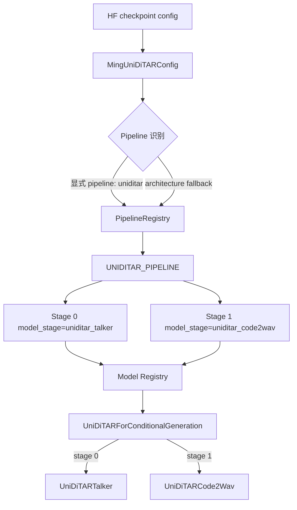
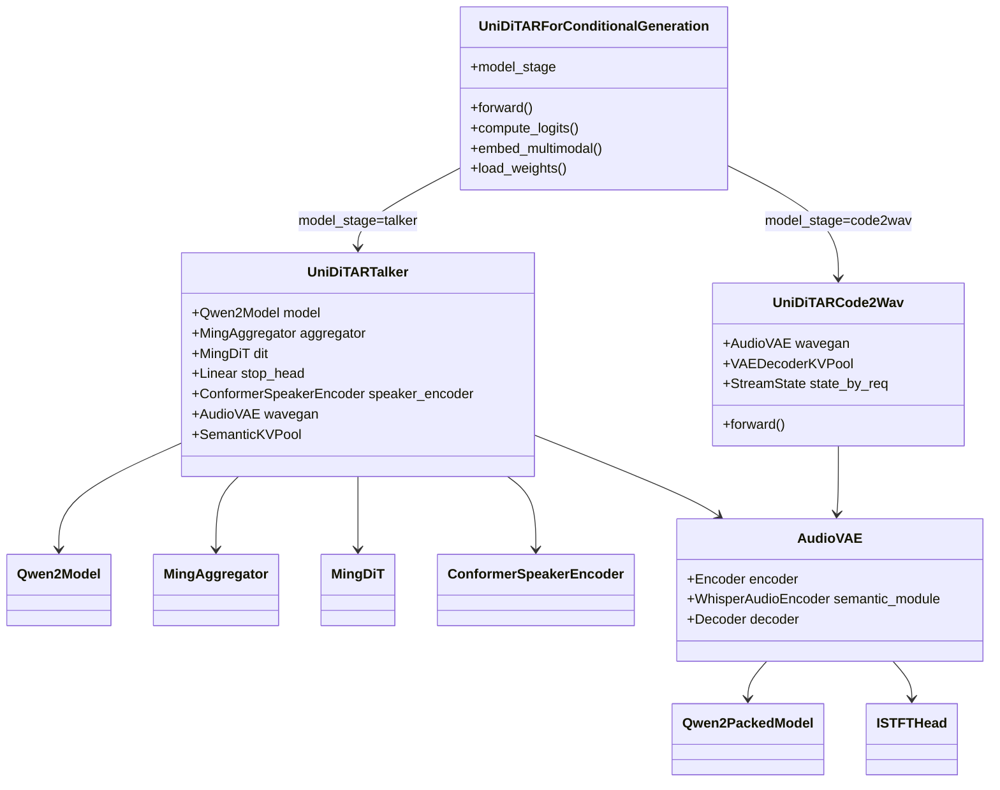
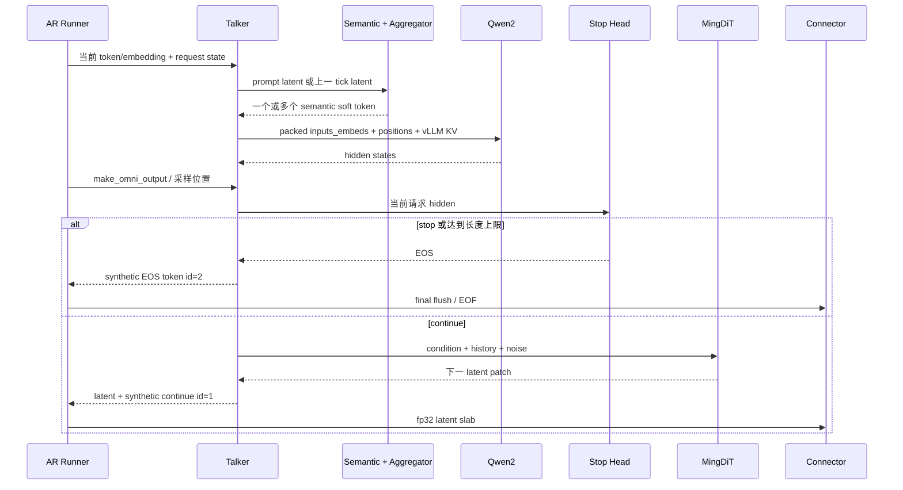
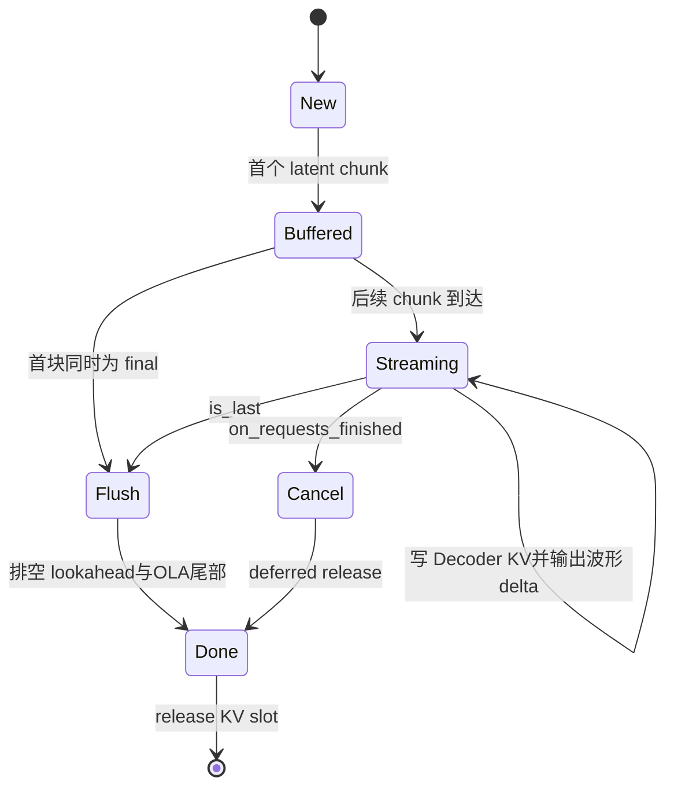
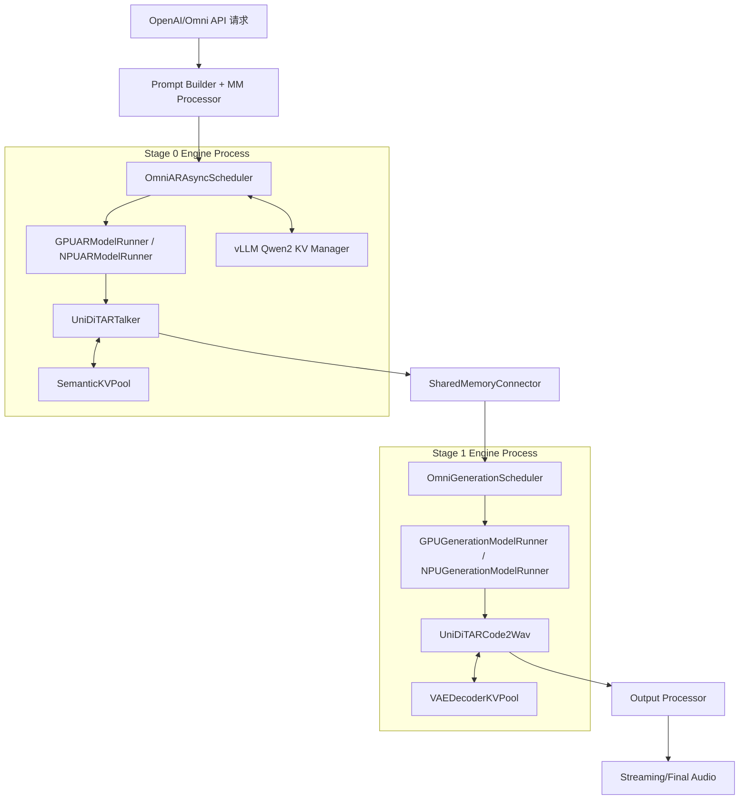
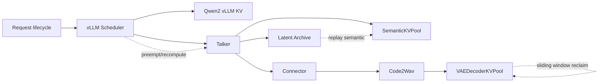
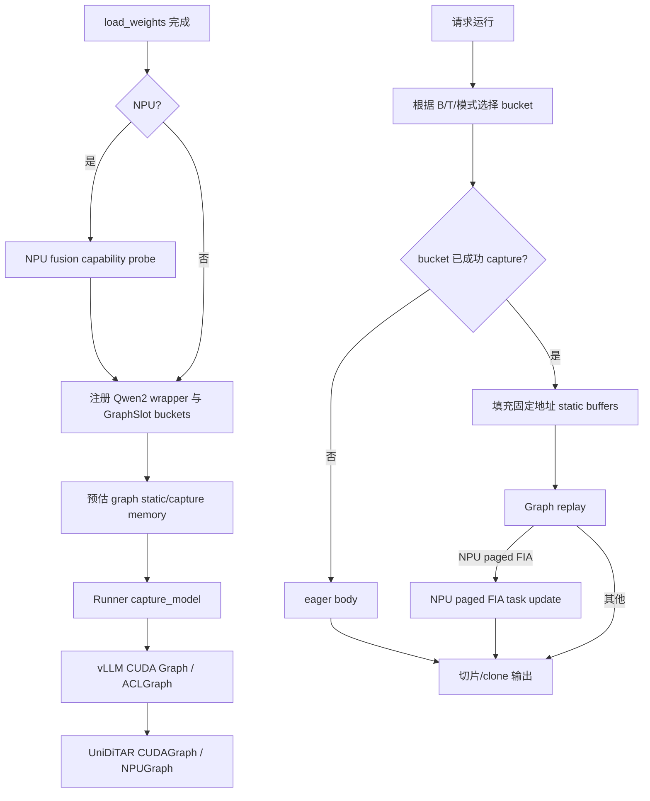

# UniDiTAR 模型结构与运行架构报告


---

## 1. 结论摘要

UniDiTAR 在当前 vLLM-Omni 中不是单体模型，而是一条固定的两阶段 TTS Pipeline：

1. **Stage 0：`UniDiTARTalker`**
   - 使用 Qwen2 做自回归条件建模；
   - 使用 AudioVAE Encoder + Whisper Semantic Encoder 提取参考音频语义；
   - 使用 MingAggregator 将一组 semantic frame 聚合成一个 LLM soft token；
   - 使用 `stop_head` 判断是否停止；
   - 使用 MingDiT + Euler/可选 SDE flow-matching，每个 AR tick 生成一个声学 latent patch。

2. **Stage 1：`UniDiTARCode2Wav`**
   - 接收 Stage 0 产生的 fp32 latent；
   - 使用 AudioVAE Decoder 将 latent 解码为波形；
   - 支持整句解码和带 paged KV、lookahead、ISTFT overlap-add 状态的流式解码；
   - 最终输出 24 kHz 音频。

两个 Stage 都注册为 `UniDiTARForConditionalGeneration`，但各自位于独立 Stage Engine 中，通过 `model_stage` 只构建当前 Stage 所需的子模型。

模型运行中存在三套不同所有权的 KV Cache：

- Stage 0 Qwen2 的 vLLM KV Cache；
- Stage 0 Whisper semantic 的模型自有 `SemanticKVPool`；
- Stage 1 AudioVAE Decoder 的模型自有 `VAEDecoderKVPool`。

图执行也不是把整个模型一次性捕获：外层请求编排、状态管理、随机数生成和流式拼接保持 eager，内部固定 shape 的 Qwen2、Semantic、Aggregator、DiT、Speaker Encoder、VAE 子模块按 bucket 捕获和重放。

---

## 2. 分析基线

| 项目 | 值 |
|---|---|
| 仓库根目录 | `/data/tha/0818/vllm-omni` |
| 分支 | `feature/hunyuan_tts3.0_vllm_0.20.0_rl-tq` |
| Commit | `67b6b13538fb2c2b0e63887fcb94885c68f792fe` |
| Commit 标题 | `refactor(uniditar): move generation parameters to model config` |
| 目标目录状态 | 分析时 `uniditar` 目录和 `deploy/uniditar.yaml` 无未提交改动 |
| 分析方式 | 只读静态分析，未启动服务、未加载 checkpoint、未执行测试 |
| 平台范围 | Portable/CUDA/NPU；其他平台仅在框架层存在通用继承，不作为本文重点 |

---

## 3. 模型身份与注册链

### 3.1 模型身份

| 项目 | 当前实现 |
|---|---|
| 模型名称 | Ming-UniDiTAR / UniDiTAR |
| HF `model_type` | `ming_uni_ditar` |
| Pipeline key | `uniditar` |
| HF architecture 别名 | `MingUniDiTAR`、`UniDiTARForConditionalGeneration` |
| vLLM-Omni architecture | `UniDiTARForConditionalGeneration` |
| 顶层入口 | `uniditar/uniditar.py::UniDiTARForConditionalGeneration` |
| Pipeline 定义 | `uniditar/pipeline.py::UNIDITAR_PIPELINE` |
| 模型类型 | 两阶段 AR + Generation TTS Pipeline |

### 3.2 注册与加载链



实际闭环如下：

1. `MingUniDiTARConfig` 注册 `model_type="ming_uni_ditar"`，并将远端 checkpoint config 归一化到本地配置类。
2. `pipeline_registry.py` 将 Pipeline key `uniditar` 映射到 `UNIDITAR_PIPELINE`。
3. `StageConfigFactory` 优先使用 deploy YAML 中的 `pipeline: uniditar`；没有显式指定时，可通过 HF architecture 命中。
4. `registry.py` 将 architecture `UniDiTARForConditionalGeneration` 映射到 `uniditar.uniditar`。
5. 顶层 wrapper 读取 `vllm_config.model_config.model_stage`，选择构建 Talker 或 Code2Wav。
6. 多模态装饰器将 UniDiTAR processor、processing info 和 dummy input builder 注册到 vLLM `MULTIMODAL_REGISTRY`。

关键证据：

- `vllm_omni/transformers_utils/configs/uniditar.py`
- `vllm_omni/config/pipeline_registry.py`
- `vllm_omni/config/stage_config.py::_resolve_scheduler`
- `vllm_omni/model_executor/models/registry.py`
- `vllm_omni/model_executor/models/uniditar/pipeline.py:29-62`
- `vllm_omni/model_executor/models/uniditar/uniditar.py:23-56`

---

## 4. Pipeline 总体运行架构

### 4.1 端到端结构图

```mermaid
flowchart LR
    U[用户请求<br/>文本 + 参考音频 + 可选时长/控制信息]
    P[UniDiTAR MM Processor<br/>Prompt + Placeholder + mm_kwargs]

    subgraph S0[Stage 0: UniDiTARTalker / LLM_AR]
        SPK[Conformer Speaker Encoder]
        VE[AudioVAE Encoder]
        SEM[Whisper Semantic Encoder]
        AGG[MingAggregator]
        LLM[Qwen2 AR Backbone]
        STOP[2-class Stop Head]
        DIT[MingDiT<br/>Euler / optional SDE]
        STATE[Request State<br/>History + Semantic KV]
    end

    CONN[SharedMemoryConnector<br/>fp32 latent chunk + metadata]

    subgraph S1[Stage 1: UniDiTARCode2Wav / LLM_GENERATION]
        NORM[Latent Denormalize]
        VD[AudioVAE Qwen2 Decoder]
        ISTFT[ISTFT + Overlap-Add]
        STREAM[Stream State + Decoder KV]
    end

    OUT[24 kHz waveform delta / final audio]

    U --> P
    P --> SPK
    P --> VE
    VE --> SEM
    SEM --> AGG
    SPK --> LLM
    AGG --> LLM
    LLM --> STOP
    STOP -->|continue| DIT
    STATE <--> SEM
    STATE <--> DIT
    DIT -->|每 tick 一个 latent patch| CONN
    CONN --> NORM
    NORM --> VD
    STREAM <--> VD
    VD --> ISTFT
    ISTFT --> OUT
    STOP -->|EOS / max length| CONN
```



### 4.2 Stage 表

| Stage | `execution_type` | `model_stage` | 核心实现 | 输入 | 输出 | Scheduler |
|---|---|---|---|---|---|---|
| 0 | `LLM_AR` | `uniditar_talker` | `UniDiTARTalker` | 文本 token、参考音频、speaker/duration 条件、历史 latent | 每 tick 一个 `[patch_size, z_dim]` fp32 latent slab；结束时附 stop reason/可选 trajectory | 默认 `OmniARAsyncScheduler`；关闭异步调度时为 `OmniARScheduler` |
| 1 | `LLM_GENERATION` | `uniditar_code2wav` | `UniDiTARCode2Wav` | Connector 携带的 `[Tchunk, z_dim]` fp32 latent；token id 仅为长度占位 | 当前 chunk 的 fp32 waveform 和 sample rate | `OmniGenerationScheduler` |

CUDA 侧 Runner：

- Stage 0：`GPUARModelRunner`
- Stage 1：`GPUGenerationModelRunner`

NPU 侧 Runner：

- Stage 0：`NPUARModelRunner`
- Stage 1：`NPUGenerationModelRunner`

两类 Runner 都复用 Omni Runner 的输入准备、Connector、输出组装和自定义 Graph capture 生命周期；不能因为基类或文件名含 `GPU` 就把框架通用逻辑理解为仅支持 CUDA。

---

## 5. 模型内部模块结构

### 5.1 类与模块关系



### 5.2 默认模型参数

下表来自本地 `MingUniDiTARConfig` 默认值；真实部署以 checkpoint config 和 `hf_overrides` 为准。

| 子模块/参数 | 默认值或结构 |
|---|---|
| 主 AR LLM | Qwen2，28 层，hidden size 1536，12 个 Q head，2 个 KV head |
| MingAggregator | 8 层，hidden size 1024，16 heads |
| MingDiT | 8 层，hidden size 1024，16 heads |
| 声学 latent 维度 | `z_dim=64` |
| Talker patch | `patch_size=4` 个 latent frame/AR token |
| DiT history | `pre_patch_size=32` 个 latent frame |
| 输出采样率 | 24 kHz |
| 默认 ODE 步数 | `s_steps=10` |
| 默认 CFG | `cfg_alpha=2.0` |
| 默认 flow scale | `fm_scale=0.999` |
| 默认最大生成 patch 数 | 600 |

配置校验会强制以下维度闭环：

- `model_dim == Qwen2.hidden_size`；
- Aggregator 输出维度等于 `model_dim`；
- DiT condition dim 等于 `model_dim`；
- DiT input channels 和 AudioVAE latent dim 等于 `z_dim`。

证据：`vllm_omni/model_executor/models/uniditar/validation.py`。

---

## 6. 输入与多模态 Processor

### 6.1 请求输入

Processor 以文本为主输入，并支持以下音频派生条件：

- `audio`：ICL 参考音频或非 ICL prompt audio；
- `spkr_emb`：从同一参考音频提取 speaker embedding；
- `dur`：由用户给定 duration 映射成 duration embedding index。

常见控制字段包括：

- `task_type`
- `prompt_text`
- `instruct_text`
- `ambient_sound_caption`
- `context_text`
- `language`
- `use_icl_mode`
- `is_first_round`
- `duration`
- `use_zero_spk_emb`

裸一维 waveform 不被接受；调用方应提供 `(wav, sample_rate)` 或文件路径。Processor 将音频重采样到 24 kHz、转成单通道并按 VAE hop 和 Talker patch 对齐补零。

### 6.2 Placeholder 机制

Processor 将音频派生成三个逻辑 modality，保证它们都进入 vLLM multimodal 路径：

| Modality | Prompt token | 行为 |
|---|---|---|
| `spkr_emb` | `<|spkr_embed|>` | 1 个 token 替换为 1 个 speaker embedding |
| `dur` | `<|dur_embed|>` | 1 个 token 替换为 1 个 duration embedding |
| `audio`，ICL 模式 | `<|spkr_latent|>` | 展开为 N 个 AudioVAE latent/Aggregator soft-token slot |
| `audio`，非 ICL 模式 | `<|audio_start|>` | 保持 1→1，占位不扩展，但将原始音频送入 preprocess |

### 6.3 输入数据流

```text
文本 + 参考音频
  -> UniDiTARMultiModalDataParser
  -> UniDiTARMultiModalProcessor
  -> prompt_token_ids + mm_kwargs
  -> Talker.embed_multimodal()
       ├─ AudioVAE Encoder -> prompt acoustic latent
       ├─ Speaker Encoder -> speaker embedding
       └─ duration index -> duration embedding
  -> embed_input_ids / inputs_embeds
  -> Qwen2 forward
```

关键证据：

- `uniditar_mm_processor.py:62-123`：音频解析和三个 modality；
- `uniditar_mm_processor.py:187-300`：Prompt 与多模态 feature；
- `uniditar_mm_processor.py:343-444`：Placeholder 替换；
- `uniditar_mm_processor.py:473-478`：多模态注册。

---

## 7. Stage 0：UniDiTARTalker

### 7.1 核心组件

| 模块 | 作用 | 主要输入 | 主要输出 |
|---|---|---|---|
| Qwen2 主模型 | 对文本、speaker、duration、semantic soft token 做因果建模 | packed token/embedding `[N, Dmodel]` | hidden state `[N, Dmodel]` |
| AudioVAE Encoder | 将 prompt waveform 编码为声学 latent | `[B, Twav]` fp32 | `[B, Tz, z_dim]` |
| Whisper Semantic Encoder | 从 latent 提取语义特征 | packed latent `[total_q, z_dim]` | `[total_q, Csem]` |
| MingAggregator | 每 `patch_size` 个 semantic frame 聚合为一个 LLM token | `[B, T, Csem]` | `[B, P, Dmodel]` |
| Speaker Encoder | 从参考音频提取说话人条件 | waveform/log-mel | `[B, Dmodel]` |
| `stop_head` | 二分类停止判定 | 当前 AR hidden | continue/EOS |
| MingDiT | 根据 LLM condition 和历史 latent 生成下一 patch | noise、condition、history、time | `[B, patch_size, z_dim]` |

### 7.2 AudioVAE Encoder

Prompt waveform 的编码链：

```text
waveform [B, Twav]
  -> 按 input_dim/hop_size 切帧
  -> Linear projection
  -> causal Qwen2Packed Encoder
  -> 可选 patch aggregation / CLS
  -> Linear 到 2 * z_dim
  -> Diagonal Gaussian posterior.sample()
  -> acoustic latent [B, Tz, z_dim]
```

注意：prompt 编码会从 posterior 采样，不是纯确定性均值编码；随后 Talker 使用 fp32 global mean/std 做 latent 归一化。

### 7.3 Semantic + Aggregator

Semantic 链：

```text
latent [total_q, z_dim]
  -> decoder.fc1
  -> GELU
  -> decoder.fc2
  -> WhisperAudioEncoder
  -> semantic [total_q, Csem]
  -> semantic normalize
  -> 按 patch_size 分组
  -> MingAggregator
  -> LLM soft token [Npatch, Dmodel]
```

MingAggregator 的内部结构：

```text
[B, T, Csem]
  -> reshape [B*P, patch_size, Csem]
  -> Linear(Csem, H)
  -> 拼接可学习 CLS
  -> 双向 Transformer blocks + RoPE
  -> 取 CLS
  -> [B, P, Dmodel]
```

Aggregator attention 是非 causal 的，因为它只在一个固定长度的 acoustic patch 内聚合局部 semantic frame。

### 7.4 Talker AR 闭环



每个 tick 的关键顺序：

1. 将 prompt latent 或上一 tick 的 latent 送入 semantic encoder；
2. Aggregator 将 semantic patch 压缩成 Qwen2 soft token；
3. Qwen2 使用 vLLM paged KV 做 AR forward；
4. 从采样位置取 hidden state；
5. `stop_head` 判断是否终止；
6. 未终止时，MingDiT 生成下一 acoustic latent patch；
7. 新 latent 一方面发送给 Stage 1，另一方面保存为下一 tick 的 semantic 输入和 DiT history；
8. `compute_logits()` 不预测文本词表内容，而是只把 token 1 或 2 的 logit 设为极大值，让标准 vLLM sampler 驱动继续/停止。

合成 token：

- `SAFE_TOKEN_ID=1`：继续；
- `EOS_TOKEN_ID=2`：结束；
- Pipeline sampling constraint：`stop_token_ids=[2]`。

### 7.5 MingDiT 与 flow-matching

MingDiT 单次网络输入大致为：

| 张量 | Shape | 说明 |
|---|---|---|
| 当前状态 `x` | `[2B, patch_size, z_dim]` | CFG 将 unconditional/conditional 在 batch 维拼接 |
| 时间 `t` | `[2B]` | flow time |
| condition | `[2B, 1, Dmodel]` | Qwen2 当前 hidden |
| history | `[2B, pre_patch_size, z_dim]` | 当前轮生成历史窗口 |

DiT Transformer 序列由以下部分组成：

```text
[timestep embedding + LLM condition]
  + [history latent]
  + [current noisy latent]
```

网络预测速度场，solver 只取最后 `patch_size` 个位置。默认 Euler 更新为：

\[
z_{i+1}=z_i+v(z_i,t_i,condition,history)\cdot(t_{i+1}-t_i)
\]

CFG 合成为：

\[
v=v_{cond}+(v_{cond}-v_{uncond})\cdot\alpha
\]

最终 latent 乘 `fm_scale`。默认运行 10 个 solver step；可选 SDE 只在配置的连续 step 区间注入噪声。随机数在 Graph 外生成并拷入静态输入，避免 Graph replay 重复同一噪声。

### 7.6 Talker 请求状态

Talker 为每个请求维护 `_RequestState`，主要包含：

- 所有已进入 semantic cache 的 latent archive；
- 当前轮 prompt、轮次起始位置；
- 上一个 latent patch；
- DiT history；
- 当前帧数、EOS、stop reason；
- SemanticKVPool slot；
- 可选 SDE trajectory。

多轮请求会保留 semantic KV 和 latent archive，只重置轮内状态。vLLM 抢占请求时，模型自有 semantic pool 会 rewind；恢复时通过 archive replay 重建 semantic KV，从而与 vLLM 的 recompute 语义对齐。

---

## 8. Stage 间 Connector 与数据契约

### 8.1 Streaming 路径

`talker2code2wav_async_chunk()` 将每个 Talker step 的二维 latent slab 缓存在请求级 buffer 中。当累计到 `code2wav_chunk_M` 个完整 patch 时发送 Stage 1；请求结束时 flush 剩余 patch，若没有剩余数据则发送纯 EOF。

代码默认 `DEFAULT_CHUNK_PATCHES=25`，但当前 `deploy/uniditar.yaml` 显式设置 `code2wav_chunk_M: 1`，因此当前部署配置的实际意图是**每生成一个 Talker patch 就向 Code2Wav flush 一次**。

主要 payload：

| Key | 含义 |
|---|---|
| `latent` | fp32 `[M * patch_size, z_dim]`，EOF 时可为空 |
| `codes.audio` | Stage 1 token 长度占位 `[0]` |
| `req_id` | 请求 ID |
| `stream_finished` / `meta.finished` | 是否最后一个 chunk |
| `chunk_id` | chunk 序号 |
| `emit_patch_count` | 本次发出的 patch 数 |
| `latent_shape` | 可观测性 shape |
| `estimated_bytes` | payload 估算字节数 |
| `final_flush` | 是否结束 flush |
| `stop_reason` | continue、stop head 或最大长度停止 |
| `trajectory` | 可选 SDE 轨迹，仅 final flush 携带 |

Stage 1 的 token id 只是调度占位。真正的 fp32 latent 通过 `SharedMemoryConnector` 的 additional/intermediate information 到达模型。

### 8.2 非流式路径

`talker2code2wav_full_payload()` 在 Talker 完成后发送完整 utterance latent：

- latent 被转为连续 fp32；
- 最大 latent frame 在同步适配路径中受 `MAX_LATENT_FRAMES=4096` 限制；
- Stage 1 识别为首次到达且同时 `is_last` 时，直接执行 `wavegan.decode()`，不创建 streaming KV slot。

关键证据：`vllm_omni/model_executor/stage_input_processors/uniditar.py:106-310`。

---

## 9. Stage 1：UniDiTARCode2Wav

### 9.1 解码结构

```text
connector latent [B, Tchunk, z_dim] fp32
  -> fp32 反归一化
  -> cast 到 AudioVAE dtype
  -> decoder.fc1
  -> one-chunk-lookahead upsample
  -> Qwen2Packed Decoder
  -> magnitude/phase projection
  -> complex spectrum
  -> ISTFT
  -> overlap-add / flush tail
  -> 必要时重采样
  -> 24 kHz fp32 waveform
```

### 9.2 整句与流式分支

| 模式 | 判定 | Decoder 路径 | KV/流状态 |
|---|---|---|---|
| Single-shot | 首次输入就是 final chunk | `wavegan.decode()` | 不使用 `VAEDecoderKVPool`，不保留 OLA 状态 |
| Streaming | 非 final，或已有流状态 | `decoder.forward_streaming()` | 使用 paged KV、lookahead、ISTFT OLA state |

### 9.3 流式状态机



每请求 `_StreamState` 保存：

- `slot`：Decoder KV pool slot；
- `upsample_state`：lookahead 上采样状态；
- `audio_buffer`、`window_buffer`：ISTFT overlap-add 尾部；
- 累计 patch 数；
- 累计 waveform sample 数。

模型每次 forward 返回的是**当前 chunk 的 waveform delta**，不是从请求开始到当前时刻的累计波形。最终 API 的流式发送或离线聚合由上层输出处理链完成。

关键证据：

- `uniditar_code2wav.py:56-80`：流式状态；
- `uniditar_code2wav.py:235-302`：Connector payload 解析；
- `uniditar_code2wav.py:323-380`：Stage 1 forward；
- `uniditar_code2wav.py:382-475`：single-shot/streaming 解码与状态回收。

---

## 10. Runtime：Scheduler、Runner 与模型调用

### 10.1 分层架构



### 10.2 关键调用链

Stage 0：

```text
API request
  -> MM Processor / Prompt Builder
  -> OmniARAsyncScheduler.schedule()
  -> AR Runner input preparation
  -> Talker.preprocess()
  -> Talker.embed_multimodal()/embed_input_ids()
  -> Talker.forward()
  -> Qwen2Model.forward()
  -> Talker.make_omni_output()
  -> stop_head + MingDiT
  -> Talker.compute_logits()
  -> standard sampler selects token 1/2
  -> async connector processor
```

Stage 1：

```text
SharedMemoryConnector payload
  -> OmniGenerationScheduler
  -> Generation Runner
  -> UniDiTARCode2Wav.forward()
  -> payload bucket by Tchunk
  -> AudioVAE.decode() or decoder.forward_streaming()
  -> OmniOutput(multimodal_outputs={model_outputs, sr})
  -> output processor / client
```

Stage 1 `compute_logits()` 返回 `None`，说明它借用 `LLM_GENERATION` 的调度和执行框架，但自身没有 token logits 和 sampler。

---

## 11. KV Cache 架构

### 11.1 三套 KV Cache 对比

| Cache | Owner | 用途 | Layout/Block | 生命周期 | 是否由 vLLM KV Manager 管理 |
|---|---|---|---|---|---|
| Qwen2 LLM KV | Stage 0 vLLM | 文本和 acoustic soft token 的 AR attention | 由当前 vLLM attention backend 决定 | scheduler 分配、抢占、recompute、释放 | 是 |
| Semantic KV | Stage 0 Talker | Whisper semantic encoder 跨 tick/跨轮缓存 | K/V 各为 `[L, blocks, block_size, kv_heads, head_dim]` | 模型 acquire；抢占时 rewind；archive replay；完成时 release | 否 |
| VAE Decoder KV | Stage 1 Code2Wav | AudioVAE Qwen2 decoder 流式 causal attention | 同上；支持 sliding-window reclaim | 首个流 chunk acquire；每 chunk advance；final/cancel release | 否 |

NPU 上模型自有 paged KV block size 固定为 128，以满足 Ascend FIA paged attention；CUDA 使用 vLLM 默认 block size。

### 11.2 模型自有 Paged KV



模型自有池的关键特征：

- 不注册为 vLLM KV cache group，`get_kv_cache_spec()` 看不到；
- 地址固定，适合 Graph replay；
- `block_table` 尾部填充 NULL block，`seq_lens` 限制真实可读范围；
- `acquire()` 只占 slot，首次 `ensure_capacity()` 才分配 block；
- `advance()` 在写入后推进真实长度；
- `rewind()` 归还 block 并将长度清零；
- Stage 1 sliding-window 可回收窗口之前的整块；
- CUDA KV 写使用 `reshape_and_cache_flash`；NPU 使用 `index_copy_`。

Stage 0 在测量可用显存后按“一个 acoustic token 对应一个 LLM token和 `patch_size` 个 semantic frame”的成本比例，在 vLLM KV 与 SemanticKVPool 之间分配 KV memory pot。Stage 1 的 Decoder pool 则根据 `max_num_seqs`、单轮长度、最大 chunk 和 sliding window 估算 block 数。

关键证据：

- `constants.py:30-65`
- `paged_kv_cache_pool.py:3-18`
- `paged_kv_cache_pool.py:78-214`
- `paged_kv_cache_pool.py:225-360`
- `paged_kv_cache_pool.py:425-449`

---

## 12. Graph/编译运行架构

### 12.1 Graph 边界

UniDiTAR 使用“外层 eager + 内层 bucket graph”的策略。

**保持 eager 的部分：**

- Python 请求状态机；
- 请求 finish/cancel/preemption 处理；
- Connector payload 组装；
- 形状分桶和 KV block 分配；
- SDE/初始噪声生成；
- Stage 1 lookahead/ISTFT OLA 的部分编排；
- 最终输出对象组装。

**可按 bucket 入图的部分：**

- Stage 0 Qwen2 主模型；
- Whisper semantic encoder；
- MingAggregator；
- MingDiT 完整 Euler solver 循环；
- AudioVAE encoder；
- Speaker Conformer；
- Stage 1 streaming AudioVAE decoder backbone。

### 12.2 Capture/Replay 流程



`GraphSlot` 的语义：

1. 注册 bucket 不代表已经 capture；
2. `capture_all()` 在 Runner 的启动 capture window 中逐 bucket 捕获；
3. 某个 bucket 捕获失败时，只将该 bucket 标记为失败并回退 eager；
4. 运行时只有 `entry.graph != None` 才 replay；
5. 带 KV 写副作用的 slot 必须提供 snapshot guard，避免 dummy capture 污染真实 cache；
6. Graph 运行会记录 hit、miss 和 split/fallback 统计。

### 12.3 NPU paged FIA 动态更新

NPU paged attention 的真实 KV 长度和 block table 每个请求、每个 tick 都会变化。当前代码在 capture 时记录 FIA graph task；replay 时：

1. 更新固定地址 buffer；
2. enqueue `NPUGraph.replay()`；
3. 在独立 NPU stream 上调用 `fia_paged_update()`；
4. 使用当前 `actual_seq_lengths_kv` 和 `block_table` 动态重绑各层 task；
5. 通过 stream/event 依赖保证更新和 replay 顺序。

因此，`deploy/uniditar.yaml:83-85` 中“Semantic paged-FIA remains eager until updater is enabled”的注释与当前代码已有 updater 的事实不一致，应视为陈旧注释，而不是当前能力边界。

关键证据：

- `graph_bucket_pool.py:187-280`：命中、回退、CUDA/NPU capture；
- `graph_bucket_pool.py:371-459`：集中注册和捕获；
- `platforms/npu/ops/uniditar_flash_attn.py`：paged FIA task 记录和动态更新；
- `uniditar_talker.py`：Talker 子图注册；
- `audio_vae/decoder.py`：Stage 1 decoder GraphSlot；
- `uniditar_code2wav.py:519-552`：Stage 1 capture 入口。

---

## 13. CUDA 与 NPU 平台差异

| 能力 | CUDA | NPU |
|---|---|---|
| Architecture 加载 | Portable `uniditar` 实现 | Platform 将 architecture 路由到 NPU overlay；overlay 通过扩展 `__path__` 回退 portable 模块 |
| 主 LLM 图 | `CUDAGraphWrapper` | `ACLGraphWrapper` |
| 自定义 bucket 图 | `torch.cuda.CUDAGraph` | `torch.npu.NPUGraph` |
| DiT attention | PyTorch SDPA/portable 路径 | Ascend FIA 路径 |
| Semantic/Decoder attention | vLLM FlashAttention | UniDiTAR FIA adapter |
| 模型自有 KV block | vLLM 默认 block size | 固定 128 |
| KV write | `reshape_and_cache_flash` | `index_copy_` |
| Paged Graph metadata | 更新静态 tensor 内容 | 还需 FIA graph task 动态重绑长度和 block table |
| Graph pool | CUDA graph pool | `torch.npu.graph_pool_handle()` |
| 融合策略 | Portable kernel/编译器 | 权重加载后、capture 前 capability probe + monkey patch |

当前 NPU overlay 目录本身主要提供包路由，模型主体仍来自 portable `uniditar`。平台差异集中在：

- NPU Runner；
- FIA adapter；
- ACLGraph/NPUGraph；
- KV block 限制；
- 权重加载后的融合安装器。

### 13.1 NPU 融合算子

`uniditar_installer.py` 在权重加载后、Graph capture 前尝试安装：

- packed QKV attention；
- Qwen2 RMSNorm；
- Qwen2 SwiGLU；
- DiT Linear + GELU；
- DiT/Conformer FIA v2；
- DiT fused RoPE；
- standalone LayerNorm；
- residual Add + RMSNorm；
- residual Add + LayerNorm。

大部分融合先用小输入与 native/fp32 reference 做 capability/数值 probe，失败则保留 portable 实现；packed-QKV 主要检查 dtype、device 和 shape，数值保护相对较弱。

---


## 15. 流式时序与生命周期

### 15.1 首包

1. Stage 0 解析文本和参考音频；
2. AudioVAE Encoder、Speaker Encoder、Semantic Encoder 处理 prompt；
3. Qwen2 完成 prefill；
4. 第一个 AR decode tick 运行 stop head 和 MingDiT；
5. Connector 按 `chunk_M` 判断是否发送；当前 YAML 中 `M=1`，因此立即发送；
6. Stage 1 创建 `_StreamState` 和 Decoder KV slot；
7. 首个 chunk 可能因 one-chunk-lookahead 只建立状态，实际可输出样本量取决于 decoder streaming 逻辑。

### 15.2 稳态

1. Talker 每 tick 追加一 patch latent；
2. SemanticKVPool 写入 `patch_size` 个 semantic frame；
3. Qwen2 vLLM KV 追加一个 acoustic token；
4. Code2Wav Decoder KV 追加 latent frame；
5. Stage 1 输出当前波形 delta，保留 lookahead 和 OLA 尾部。

### 15.3 结束与清理

- Stop head 超阈值或达到最大 decode 长度后，Talker 生成 EOS 合成 token；
- Connector flush 剩余 latent；没有剩余时发送空 latent EOF；
- Stage 1 排空 lookahead/OLA 尾部；
- `is_last` 后释放 Decoder KV slot；
- Talker 在请求完成回调后释放 semantic slot 和请求状态；
- cancel 路径通过 deferred drop 避免在最后一个 payload 解码前过早释放 Stage 1 状态。


---

## 19. 一句话总结

UniDiTAR 的本质是一个以 **Qwen2 AR hidden state 驱动 flow-matching DiT 逐 patch 生成声学 latent，再由流式 AudioVAE 解码为 24 kHz 波形**的两阶段 TTS 系统；vLLM-Omni 负责 Stage 调度、Qwen2 KV 和跨 Stage 传输，模型自身额外管理 semantic/decoder 两套 paged KV，并通过 CUDA Graph 或 ACLGraph/NPUGraph 对固定 shape 的内部计算热点进行分桶加速。
