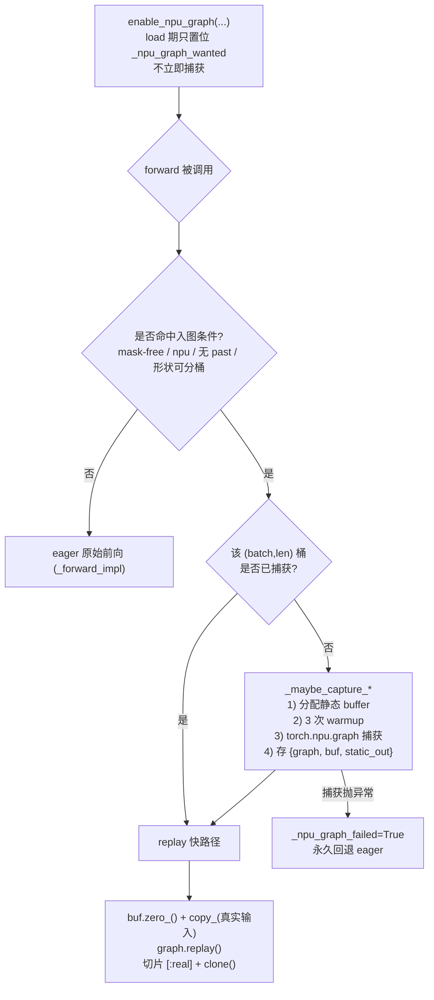
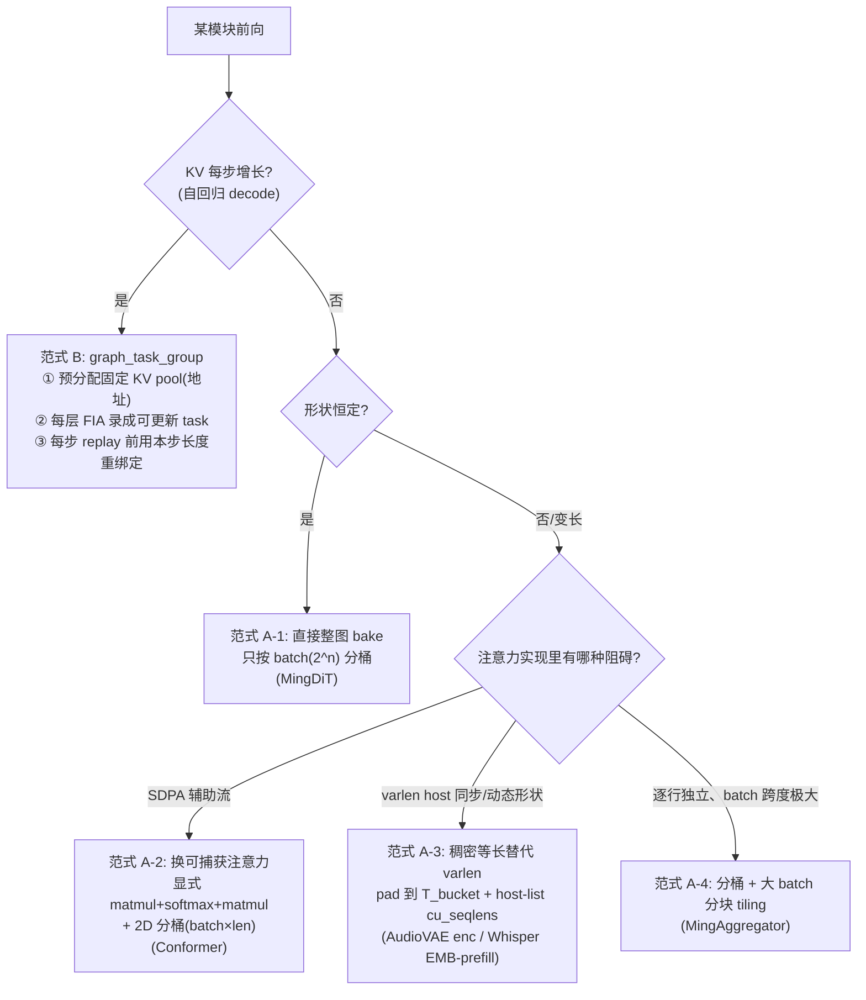
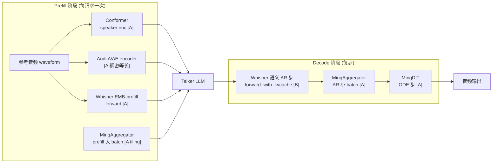

# UniDiTAR 模型入图（NPU Graph Capture）方案总述

> 代码库：`/data/tha/ttt/vllm-omni-aigc`（模块 `uniditar`）
> 平台：Ascend NPU（无 Inductor / 不走 `torch.compile`，一律用 `torch.npu.NPUGraph` 手动捕获）
> 逐模块的代码行号级索引见同目录 `NPU_GRAPH_CAPTURE.md`；本文聚焦**原理、阻碍因素、方案选择、隐患**四个层面。

---

## 目录

1. [入图逻辑：到底在做什么、为什么可行](#1-入图逻辑到底在做什么为什么可行)
2. [入图模块清单、各自特点、以及什么情况会导致入图受阻](#2-入图模块清单各自特点以及什么情况会导致入图受阻)
3. [针对不同模块特点采取的入图方案](#3-针对不同模块特点采取的入图方案)
4. [入图后的隐患：显存占用及其它风险](#4-入图后的隐患显存占用及其它风险)

---

## 1. 入图逻辑：到底在做什么、为什么可行

### 1.1 要解决的问题

TTS 推理是**大量小算子 + 高频调用**的场景（AR 每步都要跑几十层注意力/Linear/RoPE/LayerNorm）。在 Ascend 上，每个算子都要经过一次 **host → device 的下发**（`aclrtLaunchKernelWithHostArgs`）。当单算子计算量很小时，**host 下发耗时反而成为瓶颈**（host-bound），NPU 大量时间在空等下一个 kernel。

**入图（graph capture）** 就是把"一次前向里成百上千个 kernel 的下发序列"录制成一张**静态执行图**，之后每次只用一条 `replay()` 指令把整张图一次性重放到设备执行，把 host 下发开销从 "O(算子数)" 压到 "O(1)"。

### 1.2 NPU Graph 的核心机制与两条铁律

`torch.npu.NPUGraph` 的捕获/重放遵循两条硬性约束，**理解它俩就能理解本项目所有设计取舍**：

```
┌─────────────────────────── capture 阶段（只做一次/每桶一次）───────────────────────────┐
│  with torch.npu.graph(g, pool=...):                                                     │
│      static_out = forward_impl(static_buffers...)  # 录制这段前向的 kernel 下发序列       │
│  # 此时并没有真正算出结果，而是记录了"在这些固定的显存地址上、按此顺序执行这些 kernel"    │
└─────────────────────────────────────────────────────────────────────────────────────┘
                                        │
┌─────────────────────────── replay 阶段（每次请求/每步）────────────────────────────────┐
│  static_in.copy_(real_in)   # 把真实输入灌进"捕获时那块固定地址"的 buffer               │
│  g.replay()                 # 一条指令重放整张图；kernel 直接读写捕获时记录的地址        │
│  out = static_out[:real].clone()   # 从"捕获时那块固定地址"的输出 buffer 取结果          │
└─────────────────────────────────────────────────────────────────────────────────────┘
```

- **铁律 1：地址必须固定（static addresses）。**
  图记录的是**显存地址**而非数据。replay 时 kernel 直接读写捕获当时的那些地址。因此所有输入/输出/中间 KV 都必须落在**预先分配、地址不变**的 buffer 上；不能每步 `torch.empty/torch.cat` 新建张量（地址会变→图读到失效地址→崩溃或算错）。
  → 这是"**KV 必须提前申请固定 buffer**"的根本原因（详见 §2.3）。

- **铁律 2：捕获期禁止 host 同步 / 禁止动态形状 / 禁止辅助流打断。**
  捕获时不能出现 D2H 同步（`.item()` / `.tolist()` / `.cpu()`）、不能出现依赖运行期数据决定的张量形状、不能出现在辅助流上异步启动的 kernel（否则录不进主图）。这三点直接决定了哪些模块"能直接入图"、哪些"必须先改造"。

### 1.3 本项目统一的入图生命周期（懒式捕获）

所有模块都遵循同一套生命周期，只是"捕获体"和"分桶维度"不同：



关键点：
- **懒式（lazy）**：`enable_npu_graph` 只置位，真正捕获推迟到"权重已加载、拿到真实 dtype/device/shape 的首个合格 forward"。避免过早捕获拿到错误 dtype。
- **分桶（bucketing）**：变长输入向上取整到有限的几个"桶"（batch 取 2 的幂、序列长取 128 的倍数），每桶一张图，控制图数量。
- **优雅降级**：任何捕获异常都 `_npu_graph_failed=True` 永久回退 eager——**入图永远只是加速手段，不改变正确性**。

---

## 2. 入图模块清单、各自特点、以及什么情况会导致入图受阻

### 2.1 已入图模块一览

| 模块 | 文件 | 触发阶段 | 形状特点 | 注意力类型 | 采用范式 |
|---|---|---|---|---|---|
| **MingDiT**（扩散主干） | `modeling_dit.py` | decode 每个 ODE 步 | seq 恒定，仅 batch 变 | FIA dense | A |
| **MingAggregator**（patch 聚合） | `modeling_dit.py` | decode + prefill | 逐行独立，batch=`B*P` 跨度极大 | FIA（行内） | A + 分块 tiling |
| **Conformer**（speaker encoder） | `conformer.py` | prefill | 变长参考音频（batch × mel 长） | 相对位置 SDPA | A（改可捕获注意力） |
| **AudioVAE encoder** | `audio_vae/encoder.py` | prefill | 变长参考音频（varlen packed） | FIA varlen | A（改稠密等长） |
| **Whisper 语义 AR 步** | `audio_vae/semantic.py` | decode 每步 | **KV 每步增长** | FIA paged | **B** |
| **Whisper route-A prefill** | `audio_vae/semantic.py` | prefill（可选） | 变长 prompt 写 KV pool | FIA paged | A |
| **Whisper EMB-prefill** | `audio_vae/semantic.py` | prefill | 等长 packed | FIA varlen | A（稠密等长） |

### 2.2 三类"入图受阻"的通用因素

在给任何模块入图前，先排查它是否命中下面三类阻碍（对应 §1.2 的铁律 2）：

| 阻碍因素 | 具体表现 | 本项目里的实例 |
|---|---|---|
| **① host 同步（D2H）** | 捕获期出现 `.tolist()` / `.item()` / `.cpu()` | FIA varlen 里 `cu_seqlens.tolist()`（`fa.py:446-451`）；`pack_padded_to_varlen` 的 `.cpu().tolist()` |
| **② 动态形状** | 张量长度依赖运行期数据（变长 packing、`torch.cat` 拼变长） | AudioVAE / Whisper 的 varlen packed 输入总长随参考音频长度变 |
| **③ 辅助流 kernel** | 算子在非主流上异步启动，录不进主图 | `F.scaled_dot_product_attention` 在 Ascend 上 lower 成辅助流 kernel → 破坏捕获 |

### 2.3 重点：KV 没有提前申请固定 buffer 会不会导致入图受阻？——**会，而且是最典型的阻碍**

这正好命中 §1.2 的**铁律 1（地址固定）**，需要拆成两个层面看：

**(a) KV buffer 的"地址"层面——必须提前分配固定 pool，否则无法入图。**
NPU Graph 在捕获时记录的是"往哪块显存地址写 KV、从哪块地址读 KV"。如果 KV cache 是**每步动态 `torch.empty`/`torch.cat` 新建**（地址每步都变），那么：
- replay 时图会去读写**捕获当时那块已经失效/被复用的地址** → 结果错误甚至非法访问；
- 因此**必须预先分配一块地址固定的 KV pool**（`k_pool/v_pool`，形状 `(BC, max_k, n_kv, hd)`），捕获时把地址 bake 进图，每步只往**同一地址** scatter 写入新的 K/V。
- 结论：**KV 未提前申请固定 buffer = 违反铁律 1 = 直接导致该路径无法入图**。本项目 Whisper AR 步正是靠预分配 `k_pool/v_pool` 才得以捕获。

**(b) KV 的"长度参数"层面——即使地址固定了，FIA 的有效长度是 host 参数、每步变，仍然无法整图 bake。**
就算 KV pool 地址固定，注意力算子还需要知道"每行当前实际有多少个有效 K"——即 FIA 的 `actual_seq_lengths_kv`。它是一个 **host `List[int]` 启动参数**，且 AR 每步 +1 增长。捕获时它被写死成"捕获那一刻的长度"，replay 时不会自己更新 → 若整图 bake，注意力永远只看捕获时那个长度，**语义错误**。

这两个层面合起来，就是 Whisper AR 步**不能用范式 A（整图 bake）、必须用范式 B（`graph_task_group` 可更新任务）**的原因：

```
地址层面(a)：KV pool 提前固定分配 ────► 满足铁律 1，KV 可入图
长度层面(b)：actual_seq_lengths_kv 每步变 ─► 整图 bake 会锁死长度 ──► 每层 FIA 录成"可更新 task"
                                                                     每步 replay 前在 update_stream
                                                                     上用本步真实长度重绑定
```

> 换句话说：**"提前申请固定 KV buffer" 是入图的必要前提，但只解决了地址问题；长度这类每步变化的 host 启动参数还得靠范式 B 的 task 重绑定来补齐。** 两者缺一，AR 步都无法正确入图。

---

## 3. 针对不同模块特点采取的入图方案

### 3.1 方案选择决策树



### 3.2 逐方案说明（"特点 → 阻碍 → 对策"）

**① MingDiT —— 范式 A 原型（最简单）**
- 特点：seq 长度恒定（`1+pre_patch+patch`），只有 batch 变化。
- 阻碍：无特殊阻碍（注意力本就用可捕获的 FIA dense）。
- 对策：只按 batch 取 2 的幂分桶，直接整图 bake + replay，`[:real]` 切片（padding 行不影响有效行，注意力 batch 无关）。

**② MingAggregator —— 范式 A + 分块 tiling**
- 特点：注意力**逐行独立**（每行是独立的 `patch+1` 序列，无跨行注意力）；但 batch 跨度极大——AR 步 batch=`B`(≤16)，prefill batch=`B*P`(可上百)。
- 阻碍：若只按 `max_num_seqs` 分桶，prefill 的大 batch 命中不到桶 → 回退 eager（这正是之前"prefill 没入图"的根因）。
- 对策：利用逐行独立性——捕获固定 tile 尺寸（256）的图，大 batch **按 tile 循环 replay** 再 `torch.cat` 拼接，尾块用小桶补齐；小 batch（AR）单桶 replay。另把 `cls_embed` 从 `word_embedder(torch.zeros(...))` 改写为 `weight.view(1,1,-1).expand(...)`，去掉每步分配+gather 让图更干净。

**③ Conformer —— 范式 A + 可捕获注意力改造**
- 特点：prefill 变长参考音频；注意力是带 additive 相对位置偏置的 SDPA。
- 阻碍：`F.scaled_dot_product_attention` 在 Ascend 上走辅助流 kernel（阻碍③）→ 破坏捕获。
- 对策：加 `_capturable_attn` 开关，捕获路径改用**显式 `matmul + fp32 softmax + matmul`**（与 SDPA(attn_mask=bias) 数学等价、全是可捕获标准算子）；2D 分桶（batch × mel 长）；把每行真实长度 `xs_lens` 作为静态输入、mask 在图体内重算，避免 host 同步。

**④ AudioVAE encoder / Whisper EMB-prefill —— 范式 A + 稠密等长替代 varlen**
- 特点：prefill 变长，backbone 是 varlen packed 注意力。
- 阻碍：`pack_padded_to_varlen` 的 `.cpu().tolist()`（阻碍①）+ packed 总长动态（阻碍②）+ FIA varlen 的 `.tolist()`（阻碍①）。
- 对策：捕获路径**放弃 varlen、改走稠密等长**——每行 pad 到 `T_bucket` 跑等长因果注意力；关键是构造 meta 时把 `cu_seqlens` 存成 **host int list**（绕开 `.tolist()` 同步），`query_positions` 用常量 device tensor。因果注意力下有效区与 varlen **逐字节一致**，尾部按真实长度置零/切片。

**⑤ Whisper 语义 AR 步 —— 范式 B（唯一）**
- 特点：自回归 decode，KV 每步 +1 增长。
- 阻碍：KV 地址（需固定 pool）+ `actual_seq_lengths_kv` 每步变（host 参数无法 bake）。见 §2.3。
- 对策：预分配固定 KV pool + `graph_task_group` 把每层 FIA 录成可更新 task，每步 replay 前在 `update_stream` 上用本步长度/块表重绑定，靠图内 `event.wait`/`event.record` 保证设备端顺序恒为 `copies → 重绑定 → 计算`。另提供 load 期 `warmup_npu_graph` 把首次捕获的巨大一次性成本移出请求关键路径（TTFP）。

---

## 4. 入图后的隐患：显存占用及其它风险

入图是"**用显存和一次性捕获时间换 host 下发时间**"的权衡。主要隐患如下。

### 4.1 显存占用（最主要的隐患）

入图会**额外**吃掉一批常驻显存，来源有三：

| 显存来源 | 说明 | 与什么成正比 |
|---|---|---|
| **静态输入/输出 buffer** | 每个桶都要预分配 `buf_x`/`static_out` 等，且**按桶的最大形状（padding 后）分配、常驻不释放** | 桶数 × 单桶 padding 后张量大小 |
| **图本身的 workspace** | 每张捕获的图持有自己的 kernel workspace / 内部临时 buffer | 图数量 × 单图 workspace |
| **KV pool（范式 B）** | 为满足地址固定而**按 `max_batch × max_k` 预分配的满额 KV**，即便实际序列很短也占满 | `BC × max_k × n_kv × hd` |

**放大效应要特别注意分桶策略**：
- 2D 分桶（Conformer / encoder：batch × len）的桶数是**两维笛卡尔积**，桶多时显存膨胀快 → 用 `len_max` 上限截断（超长跑 eager），并把 batch 限制在 2 的幂少数几个。
- MingAggregator 的 tile 定为 256 而非 `B*P` 的最大可能值，就是在"prefill 一次 replay 搞定"与"静态 buffer 大小 / padding 浪费"之间取平衡——tile 越大单 buffer 越大、尾块 padding 浪费越多。
- 每个静态 buffer 都因 padding 到桶而有**内部浪费**（真实 batch=5 但桶=8，就浪费 3 行）。

**缓解措施（本项目已采用）**：懒式捕获（只捕真实出现过的桶，不预捕所有尺寸）；共享 `graph_pool_handle`（`pool=self._npu_pool_handle`）让多张图**复用同一显存池**、减少碎片；`len_max`/tile 上限封顶；超范围直接 eager。

### 4.2 首次捕获延迟（TTFP 抖动）

- 首次命中某桶时要现场 warmup(3 次) + 捕获，这一步很慢（图子系统 init、`get_max_workspace`），会让**该请求的首包延迟(TTFP)出现尖刺**。
- 缓解：Whisper AR 用 `warmup_npu_graph` 在 **load 期**预捕常见 batch，把成本移出请求关键路径。其余 prefill-only 模块因不在最热路径，接受首次抖动。

### 4.3 数值一致性风险

- 分桶 padding 依赖"**因果注意力下有效 token 看不到尾部 padding**"这一前提。若某模块是**非因果全注意力**，padding 会污染有效输出，必须显式 mask/置零——本项目已对相应路径按 `seq_lens` 置零（AudioVAE encoder）或用等长因果保证等价（EMB-prefill）。
- Conformer 把 SDPA 换成显式 softmax，用 **fp32 softmax** 保证与原实现数值接近（避免 bf16 累加误差放大）。
- **风险点**：日后若有人修改这些模块的注意力为非因果、或引入跨行依赖，分桶等价性会被打破，需重新审视。

### 4.4 pool 快照 / 状态污染风险（范式 B 特有）

- Whisper AR 若在 decode **中途**触发某新 batch 的懒捕获，捕获过程会往 KV pool 里写 dummy 数据，**可能污染正在跑的其它请求的 KV**。
- 缓解：`_maybe_capture_graph_for` 里对被涂写区域做**快照+恢复**（`snap_k/snap_v`）。这是范式 B 独有的正确性保护，范式 A（在自有 zeros buffer 上是纯函数）无此问题。

### 4.5 "看着没入图"的观感陷阱（非真实隐患，但易误判）

- 范式 B 即使已入图，profiling 里语义 32 层注意力仍表现为逐层下发 + `aclmdlRICaptureTaskUpdateBegin/End`——这是 `graph_task_group` 的固有形态，真正省掉 launch 的是 Linear/RoPE/LN/KV-scatter。
- AR 步 `REPLAY` 日志用 `info_once`，每个 batch 桶只打一次，**不代表后续没在跑图**。
- 判别应看 profiling 的 `Model ID`（`4294967295`=eager，其它=在图）或 `aclmdlRIExecuteAsync`(replay) vs `aclrtLaunchKernelWithHostArgs`(eager) 计数，而非直观感受。

---

## 附录：整体数据流与入图触点



- **[A]** = 范式 A（定长整图 bake，含各种变体）
- **[B]** = 范式 B（`graph_task_group` 可更新任务，唯一用于 KV 增长的 AR 步）

---

### 一句话总结

> 入图 = 把"一串 kernel 下发"录成"一条 replay"，核心受制于两条铁律——**地址必须固定**（→ KV 必须提前分配固定 pool，否则受阻）和**捕获期不能有 host 同步/动态形状/辅助流**。据此，形状恒定或可分桶 padding 的模块走**范式 A（整图 bake）**，KV 每步增长的 AR 步走**范式 B（task 重绑定）**；代价是常驻显存增加、首捕延迟抖动，均已用懒式捕获、共享 pool、warmup 预热、优雅降级等手段控制。
